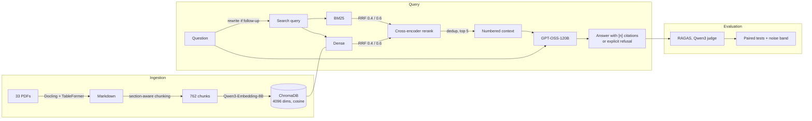

# Docente virtual — a RAG tutor for an Operating Systems course

[](https://github.com/Josejucollado/rag-docente-virtual/actions/workflows/tests.yml)


A question-answering assistant for the *Sistemas Operativos* course at the
Universidad de Jaén, built as my Bachelor's thesis (TFG). It answers **only**
from the course material (lecture notes, lab guides and exercise sheets), cites
the fragment behind every claim with `[n]`, and **says so when the answer is not
in the documents** instead of making one up.

The part I'm proudest of is not the chatbot but the **evaluation**: every design
decision (reranker, number of chunks, stemming, prompt style, free vs paid
generator) was measured on a hand-reviewed bank of 94 questions, with paired
statistical tests and a *noise band* that tells a real improvement apart from
the non-determinism of the LLMs themselves.

> The code, comments and UI are in Spanish, the language of the course and the thesis.

<!-- Screenshots: add docs/img/chat.png and docs/img/documentos.png and uncomment.

-->

## Highlights

- **Hybrid retrieval**: BM25 (with Spanish stop words) + dense embeddings fused
  with RRF → local cross-encoder reranker → one-chunk-per-section deduplication.
- **Grounded, cited answers**: the model sees exactly 5 numbered fragments; the
  sources shown to the user are exactly the ones the model read (retrieval runs
  once per answer and that same context goes to the generator).
- **Follow-up questions**: “¿y sus desventajas?” is rewritten into a standalone
  query for retrieval, while the answer is generated from the original question.
- **Structure-aware chunking** of 33 documents into 762 chunks: split by heading,
  drop covers and tables of contents, merge tiny sections, split huge ones while
  repairing broken tables and code blocks, and prefix every chunk with its
  heading path.
- **Fail loudly, never silently**: the vector collection is stamped with the
  embedding model that built it and refuses to be queried with a different one.
- **Evaluation with RAGAS** (7 metrics, an LLM judge from a *different* model
  family than the generator, prompts adapted to Spanish, a custom factual
  correctness metric) plus Wilcoxon, Friedman, Holm-Bonferroni and bootstrap CIs.
- **Web app**: FastAPI + Server-Sent Events + dependency-free vanilla JS (no CDN,
  hand-written Markdown renderer), with a document library and PDF preview.
- **Free to run**: all remote models are served by
  [Blablador](https://sdlaml.pages.jsc.fz-juelich.de/ai/guides/blablador_api_access/)
  (Helmholtz / FZ Jülich, OpenAI-compatible API); the reranker runs locally.
- **324 tests** that need no API key and no database, run in CI.

## Architecture



## Results

Final system on the 94 in-corpus questions (40 direct, 39 synthesis/multi-hop,
15 inference/edge cases), scored against reviewed reference answers:

| Metric | Score |
|---|---|
| Factual correctness (F1) | **0.621** |
| Factual recall | 0.792 |
| Faithfulness (no hallucination) | 0.915 |
| Context precision / recall | 0.787 / 0.870 |
| Correct refusals on 15 out-of-corpus questions | **15 / 15** |
| Median latency | 5.9 s |

**Measuring the noise first.** Temperature 0 does not make the served models
deterministic: across 68 questions that received *exactly* the same context,
only 3 answers came out identical. A difference in mean F1 below **±0.036** is
indistinguishable from re-running the same configuration, so every comparison
is reported against that band.

What each experiment showed (one variable changed at a time, Δ vs the final
system, p-values Holm-corrected over the 7 metrics):

| Change | ΔF1 | Takeaway |
|---|---|---|
| Verbose answer style | −0.057 | Says more than asked: gains recall, loses precision. |
| `bge-reranker-v2-m3` instead of mMiniLM | +0.042 (n.s.) | Only retrieval change with a trend, but 8× slower on CPU (46 s/answer). |
| No reranker at all | +0.006 | The small cross-encoder adds nothing measurable. |
| 3 or 8 chunks instead of 5 | −0.016 / +0.005 | More context → more coverage but worse ordering; same F1. |
| Spanish stemming in BM25 | +0.017 | Inside the noise band; it also merges *proceso* and *procesador*. |
| Apertus-8B generator | **−0.128** (p=0.002) | A small model hallucinates: it answered 12 of 15 out-of-corpus questions. |
| **GPT-5.1 (paid) generator** | −0.031 (n.s.) | Paying for the generator buys nothing: the ceiling is retrieval. Total cost of the experiment: $0.87. |

Full tables and discussion (Spanish): [`thesis/RESULTADOS.md`](thesis/RESULTADOS.md).

## Quick start

You need Python 3.12 and a free Blablador token: log in to
[codebase.helmholtz.cloud](https://codebase.helmholtz.cloud) with a university
account (eduGAIN) → *Preferences* → *Access Tokens* → scope `read_user`.

```bash
python -m venv .venv
source .venv/bin/activate            # Windows: .venv\Scripts\activate
pip install -r requirements.txt      # Linux without GPU: install CPU torch first (see the file)

cp .env.example .env                 # then paste your BLABLADOR_API_KEY

python -m cli.process_md --reset     # build the vector index once (free, a few minutes)
python -m web                        # http://localhost:8000
```

Or with Docker, see [Running with Docker](#running-with-docker).

### Command line

```bash
python -m cli.chat                                 # chat in the terminal (/fuentes, /limpiar, /ayuda)
python -m cli.inspeccionar "¿qué es la paginación?" # the 3 retrieval stages, step by step
python -m cli.inspeccionar --db                    # what is stored in ChromaDB
python -m cli.process_md --dry-run                 # chunking statistics, no API calls
python -m cli.pdf_to_md                            # convert new PDFs (needs requirements-ingesta.txt)
```

### Evaluation

Each run has a name and its own folder in `data/ragas/<run>/`. Both phases resume
automatically if the API rate limit interrupts them.

```bash
pip install -r requirements-eval.txt
EVAL_CORRIDA=my_run python -m eval_ragas.generar_respuestas   # 1. run the RAG on the 94 questions
EVAL_CORRIDA=my_run python -m eval_ragas.puntuar              # 2. score with RAGAS (~2.8 h, rate-limited judge)
EVAL_CORRIDA=my_run python -m eval_ragas.informe              # 3. self-contained HTML report
python -m eval_ragas.comparar --corridas base_run,my_run      # 4. compare two runs (local, no API)
```

Details on the metrics, the judge and the statistics: [`eval_ragas/README.md`](eval_ragas/README.md).

## Running with Docker

```bash
cp .env.example .env                                     # your BLABLADOR_API_KEY
docker compose build                                     # CPU-only image, reranker model included
docker compose run --rm web python -m cli.process_md --reset   # build the index once (a few minutes)
docker compose up                                        # http://localhost:8000
```

The index lives in a named volume, so it survives restarts. If you build with
`INDICE_URL` pointing to the index published by the `indice` workflow, the image
ships with it and the second step is unnecessary.

The `herramientas` image adds ingestion, evaluation and the tests:

```bash
docker compose --profile herramientas run --rm herramientas            # run the test suite
docker compose --profile herramientas run --rm herramientas \
  python -m eval_ragas.tfg.comparativa_recuperacion                   # local reports, no API
```

Deployment as a public demo (GHCR image + Hugging Face Space, with per-minute
question limits via `DEMO_PUBLICA=1`): see [`deploy/huggingface/`](deploy/huggingface/).

## Configuration

Defaults live in [`rag/config.py`](rag/config.py), each with the measurement that
justifies it. All of them can be overridden with environment variables.

| Setting | Default | Variable |
|---|---|---|
| Generator | GPT-OSS-120B (Blablador) | `BLABLADOR_MODEL_RAG` |
| Judge and query rewriter | Qwen3.8-Flash-Next, reasoning off | `BLABLADOR_MODEL_JUDGE` |
| Embeddings | Qwen3-Embedding-8B, 4096 dims | — |
| Reranker | `cross-encoder/mmarco-mMiniLMv2-L12-H384-v1` (local) | `RERANKER_MODEL`, `USAR_RERANKER=0` |
| Candidates / chunks in context | 20 / 5 | `RETRIEVER_K` / `RERANK_K` |
| Hybrid weights | BM25 0.4 · dense 0.6 | — |
| Answer style | `conciso` | `ESTILO_RESPUESTA` |
| Optional paid generator | OpenAI, with a per-run spending cap | `PROVEEDOR_RAG=openai`, `OPENAI_MODEL_RAG`, `PRESUPUESTO_USD` |

Models are pinned by their exact identifier, not by an alias: Blablador re-points
aliases without notice, which would silently make two runs incomparable.

> Pass run variables (`EVAL_CORRIDA`, `RERANK_K`…) on the command line, never in
> `.env`: the `.env` is loaded with `override=True` and would win over the shell.

## Project structure

```
rag/            the RAG core: config, retrieval, generation (everything imports it)
cli/            command-line tools: pdf_to_md, process_md, chat, inspeccionar
web/            FastAPI app (SSE chat, document library) + vanilla JS frontend
eval_ragas/     evaluation: generate, score, report, compare runs, statistics
  tfg/          the thesis experiments: ablation reports and PDF figures
tests/          324 tests, no API or database needed
data/           corpus (PDF + Markdown) and the two question banks
docs/           PIPELINE.md, the whole pipeline step by step (Spanish)
thesis/         thesis sources, figures and results
deploy/         Hugging Face Space for the public demo
Dockerfile, compose.yaml   web image and the optional tools image
```

**One implementation, used everywhere.** The terminal chat, the web app and the
evaluation all import the same `rag` package, so what you see in the browser is
exactly what was measured.

## Development

```bash
pip install -r requirements-dev.txt
python -m pytest -q        # ~15 s, no API key needed
ruff check .
```

## Troubleshooting

| Symptom | Cause and fix |
|---|---|
| `No existe la colección "documentacion_blablador"` | The index is not versioned: run `python -m cli.process_md --reset`. |
| `Falta la variable de entorno BLABLADOR_API_KEY` / HTTP 401 | Create `.env` from `.env.example`; tokens expire after one year. |
| HTTP 429 during an evaluation | Blablador rate limit (the key is locked 60 s, doubling each time). Wait and re-run the same command: progress is saved. |
| Changing `EVAL_CORRIDA` has no effect | It is also written in `.env`, which overrides the shell. Remove it from `.env`. |
| `No module named 'langchain_community.chat_models.vertexai'` | `langchain-community>=0.4.2` breaks `ragas`; keep it `<0.4.2` as pinned. |

## Thesis

The full thesis (in Spanish) will be published in [`thesis/`](thesis/) once it is
finished. The design rationale for every pipeline step is in
[`docs/PIPELINE.md`](docs/PIPELINE.md).

## License

Code under the [MIT License](LICENSE). The course material in `data/` belongs to
its authors at the Universidad de Jaén and is not covered by that license.
